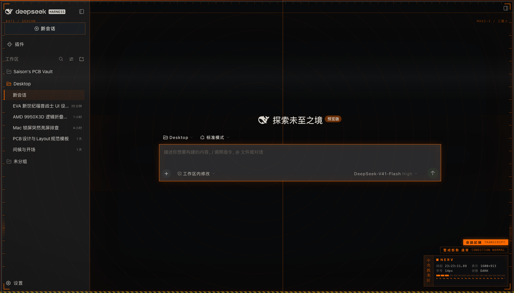
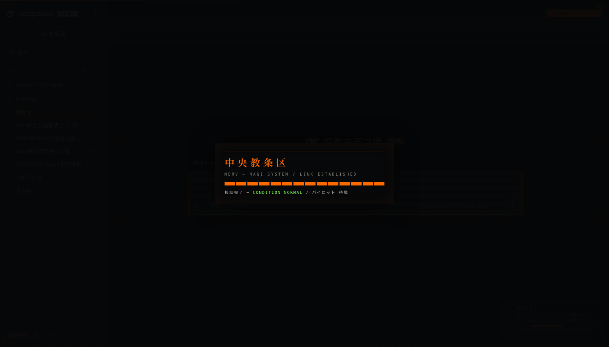
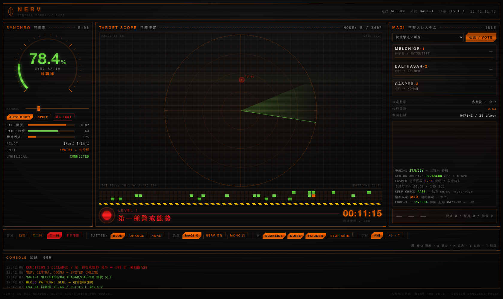
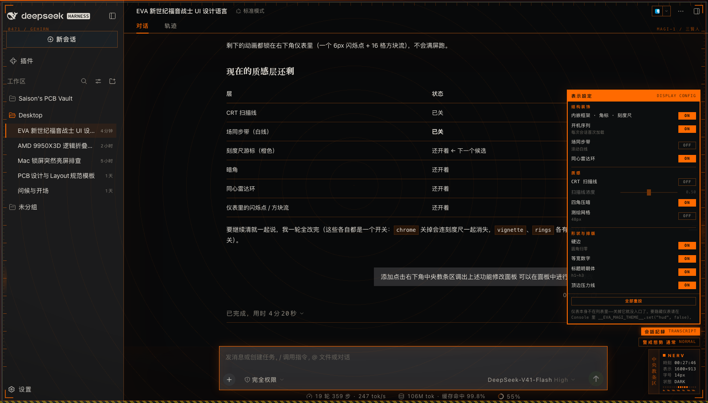

# dsh-eva-magi-theme

[](https://github.com/seaison/dsh-eva-ui/actions/workflows/ci.yml)

把 **NERV 中央教条区**的界面语言装进 DSH Web GUI 的皮肤插件。

暗色是本体（MAGI / 中央教条区终端），浅色是配套的「EVA 技术资料」纸质版。
皮肤的调色与排版全部来自一份独立的设计稿 —— 一个叫 `nerv-hud` 的可交互 HUD 原型，
本插件是那套语言在真实产品界面里的落地版本。



> **真实截图**：DSH Web GUI 加载本插件后的样子（在一个独立 profile 里跑起来的实例）。
> 右下角是仪表簇（竖排「中央教条区」+ 实时读数），四周是内嵌框架、四角 L 标、
> 刻度尺、危险条纹与反白标签块；中央大片空白上是极淡的同心雷达环。

每次会话首次加载会放一段开机序列（约 2.6 秒后自行淡出，`pointer-events:none` 所以从不挡操作）：



设计语言来自一份独立原型（不是 GUI 截图）：



> 皮肤的外观可直接核对的还有：[`docs/palette.html`](docs/palette.html) 色卡与
> [`docs/TOKENS.md`](docs/TOKENS.md) 对照表，都由代码生成。

---

## 效果

| 层 | 改了什么 |
| --- | --- |
| **令牌层**（107 个 `--dsw-alias-*`） | 全部别名令牌换成 EVA 配色：底色 `#08090a`、主色 `#ff6a00`、数据绿 `#7cff4f`、警戒红 `#ff1e1e`、正文暖白 `#e8e4dc`（刻意不用纯白）。边框变成橙色发丝线，滚动条像仪表刻度，选中色是主色 |
| **结构装饰层** | 内嵌发丝框架 + 四角 L 标 + 左右刻度尺（带游标扫描高光）+ 底部危险条纹 + 顶边压力线与刻度 + 四角规格编号（`0471 / GEHIRN`、`MAGI-1 / 三賢人`）+ CRT 三枪色散 |
| **今日已用** | 翻面时同时显示**今日花费概算**：宿主记录本机产生的 token 用量（`session/event`），客户端按价目表 × 峰谷时段**在本地计价**。只记 token 数与模型名，不记对话内容；标注「概算，非账单」 |
| **余额翻面** | **点右下角两个标签块** → 3D 翻转 → 背面显示**账户余额剩余**（`¥110.00` 形式）。余额由宿主半边用 DSH 凭据里的 API Key 向 DeepSeek 官方 `user/balance` 取，带 60 秒缓存；取不到时如实显示原因（未配置密钥 / 网络失败 / 本机校验未过），**不会编一个数字** |
| **峰谷时段显示** | 右下两个标签块显示 **DeepSeek 当前计费状态 + 下一切换倒计时**：高峰＝琥珀「高峰料金 / PEAK RATE」，空闲＝数据绿「空闲料金」，周末＝「週末料金」，法定节假日＝「休日料金」；距切换 ≤30 分钟时状态块闪烁预警。倒计时跨天会写成「4日 08:22:03」。**全部在本地按规则推算，不联网**；`pricing` 开关可退回原来的静态装饰文案 |
| **设置面板** | **点右下角仪表即可调出**：11 个开关 + 扫描线浓度滑杆 + 全部重设，改完即时生效并记忆。面板自己也会避让输入框（输入框贴底时整体抬到它上方） |
| **对齐** | 右下角两条标签栏与下方仪表**左右边缘齐平**，整体是一块矩形仪表盘，不是三块参差的碎片 |
| **仪表簇**（右下角） | **可缩放**（默认 1.5，范围 0.7–2.3，滑杆或 Cmd/Ctrl + 滚轮；缩放只作用于仪表，设置面板保持原尺寸）； 竖排明朝体「中央教条区」+ 橙底反白标签块（`会話記録 / TRANSCRIPT`、`警戒態勢 通常`）+ 四路**真实**读数 + 方块流动画。读数取真实值：时刻、视口尺寸、会话正文字号、当前色板 —— 不做假遥测 |
| **开机序列** | 每次会话首次加载放一段「NERV — MAGI SYSTEM / LINK ESTABLISHED」接续画面（明朝体大字 + 进度方块），约 2.6 秒后淡出 |
| **形状层** | 圆角全部压到 0 —— EVA 的世界里没有圆角（`--dsw-radius-panel` 默认 28px，这是最激进的一刀，可以关） |
| **质感层** | 暗角 + 同心雷达环 + 可选 48px 测绘网格。**CRT 扫描线与场同步带默认关闭**（实测后按用户要求先后去掉；`set("scanlines", true)` / `set("beam", true)` 可随时开回） |
| **排版层** | 标题走**明朝体**：靠 `font-family` 的逐字符回退，拉丁仍吃系统无衬线，只有汉字落到 Hiragino Mincho ProN；全局等宽数字（`tabular-nums`），读数不会随内容抖动 |

### 元素装饰（直接作用于应用组件）

挂钩一律用应用自己的 `data-*` 语义属性（`data-conversation-header`、`data-composer-card`、
`data-sidebar-right-panel`、`data-dockkit-surface` …），**不用 CSS Modules 的哈希类名**——
那些每次构建都会变。并且只用不会改变布局、不会覆盖应用自身样式的属性
（`box-shadow` / `outline` / `border-color` / `letter-spacing`），刻意避开
`::before`/`::after`（可能撞掉应用自己的伪元素）与 `background-image`：

- 顶栏：`inset 0 -1px` 画分隔线（改 `border-width` 会挤动内容）
- 输入卡片：外圈橙色发丝线，聚焦时整圈点亮 + 外发光
- 会话列表选中项：左侧 2px 橙色标志条
- 主区域：一层极淡的橙色环境光
- 键帽、代码块、`hr`（变危险条纹）、滚动条、浮层（橙色外环）、焦点环

---

## 安装

### 先决条件（DSH 对插件的三条要求）

1. 包必须声明组合包 —— `package.json` 里的 `dsh.bundle.patch` 指向一个 `cordis.patch.yml`。
   没有它，插件管理器会直接拒绝：`这个包没有声明组合包，不能作为插件管理`。
2. 不能带需要批准的安装脚本（`postinstall` 之类）。本插件没有任何安装脚本，
   所以安装时不会弹批准框。
3. `peerDependencies` 要和当前 DSH 运行时兼容（应用会校验并可能拒绝）。
   本插件**零依赖、零 peer**，这一条自动满足。

### 方式 A：插件管理器（桌面版走这条）

入口在**左侧栏的「插件」面板**（不是「设置」里），点它的图标，然后：

**「添加插件」** → 在「包名或地址」里填下面三种之一 → 安装

| 填什么 | 前提 | 例子 |
| --- | --- | --- |
| **本地目录路径** | 本机有这个目录 | `/Users/you/Desktop/dsh-eva-magi-theme` |
| **GitHub 仓库地址** | 仓库已推送 | `https://github.com/seaison/dsh-eva-ui` |
| **npm 包名** | 已发布到 npm | `dsh-eva-magi-theme` |

进度落在一个面板里（有安装引导和示例），完成后列表里会出现这个插件。

### 方式 B：命令行（只对非 `desktop` profile 有效）

```bash
# 从自带的 web 模板建一个自己的 profile
dsh <name> --from-default-profile web

# 装 / 卸
dsh plugin --profile <name> add link:/abs/path/to/dsh-eva-magi-theme
dsh plugin --profile <name> add dsh-eva-magi-theme        # 也可以用包名
dsh plugin --profile <name> remove dsh-eva-magi-theme
```

> `dsh plugin` 内部就是 **pnpm 的转发器**：它把依赖写进 profile 的 `package.json`、
> 更新 `pnpm-lock.yaml`，并往 `dsh.profile.bundles` 里加一条。
>
> ⚠️ `--profile desktop` 会被**硬编码拒绝**（`profile "desktop" is managed exclusively
> by the Electron application`）——那个 profile 归桌面应用独占，没有绕过开关。

### 方式 C：桌面版的手工安装（CLI 被挡住时的变通）

```bash
P="$HOME/.dsh/profiles/desktop"
PNPM="/Applications/DSH Desktop.app/Contents/Resources/app/node_modules/pnpm/bin/pnpm.mjs"

cd "$P"
node "$PNPM" add "link:/abs/path/to/dsh-eva-magi-theme" --config.minimumReleaseAge=0

# 再加 bundle 条目（这一步 pnpm 不管，必须自己做）
python3 - <<'PY'
import json, pathlib
p = pathlib.Path.home()/".dsh/profiles/desktop/package.json"
d = json.loads(p.read_text())
b = d["dsh"]["profile"]["bundles"]
if "dsh-eva-magi-theme" not in b:
    b.append("dsh-eva-magi-theme")
    p.write_text(json.dumps(d, indent=2, ensure_ascii=False) + "\n")
PY
```

**为什么必须走 pnpm，而不是手改 `package.json`**：只改 manifest 而不更新
`pnpm-lock.yaml`，将来应用一旦以 `--frozen-lockfile` 安装，会因为两者不一致
**直接把启动搞挂**。pnpm 会把依赖、`node_modules` 链接、lockfile 三样一次写对。

### 生效时机

- profile 里 `patchReload: live`（桌面版默认）→ 应用**自己热加载并重载界面**，
  通常几秒内就能看到皮肤；
- 否则需要刷新页面（`Cmd+R`），或按插件管理器的提示重启 —— 它的原话是
  「更改将在下次启动生效」。

### 卸载

插件管理器里找到 `dsh-eva-magi-theme` → 卸载；或按方式 C 反过来做：

```bash
cd "$HOME/.dsh/profiles/desktop"
node "$PNPM" remove dsh-eva-magi-theme     # 再从 dsh.profile.bundles 里删掉那一行
```

插件不写任何宿主侧状态、不改设置、不碰会话数据。卸载后唯一残留是浏览器里的
两个键（皮肤选项与会话标记），删掉即可：

```js
localStorage.removeItem("dsh-eva-magi-theme:options");
sessionStorage.removeItem("dsh-eva-magi-theme:booted");
```

> 用 `link:` 方式安装时，插件直接指向你的仓库目录 —— **别移动或删除那个目录**，
> 否则插件会失效。好处是改完代码刷新一下即可，不用重装。

---

## 选项

**主入口：点右下角的仪表簇**（那个竖排写着「中央教条区」的小方块），会弹出设置面板：



面板里是 11 个开关 + 扫描线浓度滑杆 + 「全部重設」。改动即时生效、写进 `localStorage`，
下次刷新还在。

**备用入口**：Console 钩子。面板与它共用同一条写入通道，两边改的是同一份状态 ——
面板开着时从 Console 改值，面板控件会跟着刷新：

```js
__EVA_MAGI_THEME__.set("chrome", false)          // 关掉框架/角标/危险条纹/刻度尺/编号
__EVA_MAGI_THEME__.set("hud", false)             // 关掉右下角仪表簇
__EVA_MAGI_THEME__.set("boot", false)            // 关掉开机序列
__EVA_MAGI_THEME__.set("beam", false)            // 关掉走行的场同步带
__EVA_MAGI_THEME__.set("rings", false)           // 关掉同心雷达环
__EVA_MAGI_THEME__.set("scanlines", true)        // 打开 CRT 扫描线（默认关）
__EVA_MAGI_THEME__.set("scanlineStrength", 0.25) // 扫描线浓度 0~1
__EVA_MAGI_THEME__.set("hardEdges", false)       // 恢复 DSH 原来的圆角
__EVA_MAGI_THEME__.set("grid", true)             // 打开测绘网格背景
__EVA_MAGI_THEME__.set("topLine", false)         // 关掉顶边主色压力线
__EVA_MAGI_THEME__.set("minchoHeadings", false)  // 标题回到哥特体
__EVA_MAGI_THEME__.set("vignette", false)        // 关掉暗角
__EVA_MAGI_THEME__.reset()                       // 全部回到默认值
```

选择存在 `localStorage`（键 `dsh-eva-magi-theme:options`），刷新后保留。

| 选项 | 默认 | 说明 |
| --- | --- | --- |
| `balance` | 无 | 余额没有开关：它只在**你点击标签翻面时**才请求一次，不点就不联网 |
| `hudScale` | `1.5` | 仪表缩放倍率，**0.7–2.3**（1.5 正好是范围中点）。面板滑杆或 Cmd+滚轮。**只放大仪表本身，设置面板不跟着放大** |
| `pricing` | `true` | 峰谷时段与倒计时（替换右下两个标签块为实时计费状态） |
| `chrome` | `true` | 结构装饰：内嵌框架 + 四角 L 标 + 刻度尺 + 危险条纹 + 反白标签块 + 规格编号 + 色散 |
| `hud` | `true` | 右下角仪表簇（竖排汉字 + 真实读数 + 方块流） |
| `boot` | `true` | 开机序列，每个浏览器会话只放一次 |
| `beam` | `false` | 走行的场同步带（滚动的白线），9 秒一遍；默认关 |
| `rings` | `true` | 同心雷达环底纹 |
| `scanlines` | `false` | CRT 扫描线，3px 周期（默认关） |
| `scanlineStrength` | `0.5` | 扫描线不透明度；浅色模式下自动再减半 |
| `vignette` | `true` | 四角压暗 |
| `grid` | `false` | 48px 测绘网格 |
| `topLine` | `true` | 顶边主色渐变线 + 刻度 |
| `hardEdges` | `true` | 圆角归零 |
| `tabularNumbers` | `true` | 等宽数字 |
| `minchoHeadings` | `true` | `h1~h3` 的汉字走明朝体 |

---

## 它是怎么做到的

皮肤只走官方通道，不 hack DOM、不抢选择器优先级。

**为什么令牌必须用 API 而不是 CSS。** `ctx.theme` 组合出的主题快照由 ui-layout 以
inline style 写到 `<body>` 上：

```js
body.style.setProperty("--dsw-alias-bg-base", "#101315")   // 快照里的每个令牌
```

inline style 压过任何样式表规则，所以「写一段 CSS 覆盖 `--dsw-*`」这条路是走不通的。
本插件因此调用官方的令牌层接口：

```js
ctx.theme.overrideTokens("dsh-eva-magi-theme", {
  "--dsw-alias-bg-base": { light: "#f2efe8", dark: "#08090a" },
  // …另外 106 个
})
```

令牌层叠在用户当前主题之上、随 light/dark 自动解析，返回的 disposer 让卸载和热重载
都能精确回收。装饰层（扫描线、网格、硬边、明朝体）放在插件自有的样式表与覆盖层里，
和插件同生共死。

细节推导见 [`docs/DESIGN.md`](docs/DESIGN.md)。

---

## 兼容性

| | |
| --- | --- |
| 实测环境 | DSH Desktop **2.0.17**，`@deepseek-ai/dsh-client-ui-theme` **0.2.0-rc.2** |
| 令牌来源 | 从上述版本的客户端 bundle 中读取并逐条核对（107 个别名令牌全覆盖） |
| 操作平台 | macOS（明朝体走 Hiragino Mincho ProN）。Windows / Linux 会落到 YuMincho / Songti / `serif`，标题观感会不同 |

皮肤依赖的是 `ctx.theme` 的公开契约（`overrideTokens` / `inject: ["theme"]`）与
107 个 `--dsw-alias-*` 别名令牌名。DSH 大版本升级若改动令牌名，皮肤会静默少生效几个
令牌而不会报错 —— `npm test` 里的令牌核对就是为此准备的（见下）。

---

## 峰谷时段是怎么算的

规则与 DSH 生态里已有的实现（`dsh-whale-widget`）同源，依据是 DeepSeek 官方计费文档
与国务院节假日安排：

| 时段 | 判定 |
| --- | --- |
| **高峰** | 北京时间 **周一至周五（不含中国法定节假日）9:00–12:00、14:00–18:00** |
| **空闲** | 其余全部，含 **周末**（2026-08-23 起）、**调休上班的周末**、**中国法定节假日全天**（2026-09-19 起） |

倒计时用与判定完全同源的函数扫北京时间 0/9/12/14/18 点边界得出，所以不会出现
「标签说空闲、倒计时却按高峰算」这种不一致（节假日优先于周末也是为此——国庆里的周六
报「休日」才和 4 天的倒计时对得上）。

**这些规则会过时。** 节假日清单只覆盖到 2026 年；超出覆盖范围时状态照旧推算，
但标签的副文案会标上「推定」，如实告诉你这一条没算准。每年 11 月国务院发布次年
安排后需要补清单（`lib/client.js` 里的 `HOLIDAY_VALLEY` / `HOLIDAY_COVERED_YEAR`）。

## 余额是怎么取到的

宿主半边（`lib/index.js`）在 `webServer` + `credentials` 就绪后注册一条只读路由，
浏览器半边翻面时去 `fetch` 它：

```
点击标签 → fetch /dsh-eva-magi/balance.json
          → 宿主：ctx.credentials.resolve("DEEPSEEK_API_KEY")
          → GET https://api.deepseek.com/user/balance
          → 解析 balance_infos[0].total_balance（优先人民币钱包）
          → 界面显示 ¥110.00
```

**为什么余额不能由浏览器半边自己取**：客户端按设计读不到密钥（这是对的，
不该放宽）。所以这一步只能由宿主做，也就必须做请求栅栏 —— 相关代码与
单测在 `lib/host-balance.mjs` 与 `tools/verify-host.mjs`
（39 项断言，覆盖 DNS 重绑定、后缀混淆、跨站、Origin 不匹配等攻击面）。

宿主半边**刻意不把 `webServer`/`credentials` 写进 `exports.inject`**，而是用子作用域
`ctx.inject([...], scope => ...)`：写进顶层会让整个插件在缺少这些服务的组合里
永远等不到依赖 —— 连皮肤都不会出现。现在服务缺失只是余额那面显示「未対応」。

## 放大之后仪表会不会挡住输入框

不会 —— 这是整个缩放功能的硬约束，四档自动降级（实测 1600 宽窗口）：

| 缩放 | 档位 | 位置 | 标签块 |
| --- | --- | --- | --- |
| 0.7 ~ 约 1.6 | `full` | 右下角 | 显示 |
| 约 1.6 ~ 约 1.75 | `compact` | 右下角 | 收起（只剩竖排仪表） |
| 1.8 ~ 2.3 | `lifted` | **抬到输入框上方** | 显示 |

阈值不是写死的常量：仪表会记住自己在 `full` / `compact` 两档下**实际量到**的宽度，
再拿「输入框右缘到视口右缘」的实时留白去比。写死常量踩过坑 —— 改一次标签文案，
常量就偏了 5px，判定照样通过但仪表真的压到了输入框。

最后一档 `lifted` 是**为放大空间专门加的**：尺寸上限提到 2.3 之后，1.8 倍以上连
`compact` 都塞不进角落。而设置面板是仪表的子元素 —— 仪表一 `display:none` 就把
面板也藏了，用户会**再没有入口把尺寸调回来**（只能开 Console）。抬到输入框上方
既守住了「不压控件」，也不会把人锁在门外；代价是那一档会盖住右侧一小块正文。

## 已知限制

1. **设置面板没有集成进应用的「设置」。** DSH 的「外观」那一行由官方主题占据，第三方主题
   没有 UI 插槽，所以面板是插件自绘的浮层，入口在右下角仪表上（点它弹出）。
   另外面板里**刻意不列 `hud` 自己**——面板是仪表的一部分，把它关掉等于把自己关在门外；
   真要隐藏仪表，用 `__EVA_MAGI_THEME__.set("hud", false)`。
2. **不新增第三个外观选项。** 皮肤跟随你的 light / dark / system 偏好叠加，而不是注册一个
   `eva-magi` 主题再强行 `setTheme()` —— 后者会和持久化的偏好打架，而且「外观」那行不会
   显示它，用户会看到选择与结果不一致。
3. **圆角归零很激进。** 28px → 0 是本皮肤最强的一刀，个别组件可能因此显得生硬；
   不喜欢就 `set("hardEdges", false)`。
4. **覆盖层盖在所有内容之上**（`z-index` 取最大值，但 `pointer-events:none`）。
   这是刻意的：弹窗和提示也应该是 CRT 里的一部分。
5. **装饰层全部挤在右下角。** 这是刻意的：第一版把两个标签分别放在右上与左下，
   实测当场盖住了应用的侧栏折叠按钮和「设置」。装饰绝不能压住控件，而这块界面里
   只有右下角（正文列居中、左栏固定、右栏可选）是稳定空着的。所以标签、仪表、
   说明全都叠在同一个角，由 flex 保证互不重叠。

---

## 开发

```bash
npm test                 # 打包不变量 + 令牌核对 + 颜色关系 + 浏览器半边端到端测试
npm run test:manifest    # 只跑打包不变量（包名/id/patch 三处一致、文件都存在、零依赖）
npm run test:tokens      # 只跑 token 检查
npm run test:contrast    # 只跑对比度与极性核对（加 --report 打印全表）
npm run test:client      # 只跑浏览器半边测试（需要本机有 Chrome）
npm run check            # 语法检查 + 校验文档与代码一致（提交前）
npm run docs             # 重新生成 docs/TOKENS.md 与 docs/palette.html
```

> 本插件**零依赖**：没有 `dependencies`、没有 `peerDependencies`、没有构建步骤、
> 没有 lockfile。所以 CI 里不需要 `npm install`，克隆下来直接就能跑上面这些命令。
> `npm run test:manifest` 会把这条性质钉住。

### 浏览器半边怎么测

`tools/client-harness.html` 在真实 DOM 里模拟 `window.__ModuleLoader__` 与一个假的
`ctx`（记录 `effect` 与 `overrideTokens` 调用、并真的能回收），把 `apply()` 的完整
生命周期跑一遍。**40 项断言**覆盖：

- 模块 id 是否等于包名、`inject` 是否只依赖 `theme`；
- 令牌层是否走 `overrideTokens`、是否 107 条、是否都是 `{light, dark}` 双值；
- 样式表是否带 `data-plugin-css` 注入、浏览器是否真的解析成功（规则数 + 关键规则抽查）、
  覆盖层是否挂上且 `pointer-events:none`；
- 选项是否即时生效、是否拒绝未知键、是否持久化到 `localStorage`、新实例是否恢复；
- **回收是否干净**：卸载后样式表、覆盖层、根元素标记、令牌层是否全部消失。

`tools/run-client-harness.mjs` 用无头 Chrome 跑它并把结果变成退出码（找不到 Chrome 时
跳过而不是失败）。这是「拿不到 GUI 截图」的正面替代：**外观要你目测，行为由测试保证**。

### 颜色关系怎么测

`tools/verify-contrast.mjs` 做两件事，都是我在暗色配色上没法靠肉眼判断的：

- **对比度**（WCAG 2.1）：46 个前景/背景组合，正文 4.5:1、大字与 UI 元件 3:1。
  暗底会让文字显得比实际更清楚，肉眼判断在这里尤其不可靠。
- **极性**：官方色板里每个令牌在浅/深两套各有一个值，「谁更亮」是设计意图的一部分。
  如果覆盖把某个表面在浅色方案里弄得比深色方案还暗，就是把主题搞反了——这种错误在
  代码里看不出来，在截图里一眼就看得见。透明令牌与官方等值的令牌会跳过。

这两个检查在写这一版时**各抓到一个真实缺陷**：浅色方案的 `label-tertiary`（4.29:1）
与 `label-caption`（2.47:1）都不达标，`brand-primary-invert` 的浅/深极性和官方相反。

改 `lib/client.js` 里的 `PALETTE` 表 → 跑 `npm run docs` → 用浏览器打开
`docs/palette.html`，就能在无需装卸皮肤的情况下看到浅色/深色两侧的结果。

### 怎么在真实 GUI 里验收

外观只能靠眼睛，所以迭代时需要「装上去 → 截图 → 看图改」。两个工具：

```bash
# 1) 用独立 profile 起一个测试实例（不要动桌面版正在用的 profile）
dsh evaskin --from-default-profile web          # 首次：从 web 模板建 profile
dsh plugin --profile evaskin add link:$PWD      # 把本目录以链接方式装进去
node /Applications/DSH\ Desktop.app/Contents/Resources/app/node_modules/@deepseek-ai/dsh/lib/bin.js \
  evaskin --port 4399 --no-open                 # 启动，日志里会给带 token 的 URL

# 2) 截图（用 CDP 真实等待；chrome --screenshot 会因为 WebSocket 永不静默而挂死）
node tools/shoot.mjs "http://127.0.0.1:4399/?token=<token>" /tmp/shot.png 12000
```

链接安装意味着改完代码刷新页面即可，不必重装。

**迭代皮肤本身**需要真实 GUI：改完代码 → 在插件管理器里重新添加本地目录（或刷新页面）。
`lib/client.js` 是手写的模块加载器外壳，没有构建步骤、没有依赖，改完即生效。

### 目录

```
lib/index.js             宿主半边：只作为 loader 挂载点存在（空实现是刻意的）
lib/client.js            浏览器半边：令牌表 + 皮肤样式表 + 选项；皮肤的全部内容
cordis.patch.yml         挂载声明
tools/verify-manifest.mjs 打包不变量：三处名字一致、路径存在、零依赖
tools/verify-tokens.mjs  令牌核对（形状 / 重复键 / 与官方令牌名比对）
tools/verify-contrast.mjs 颜色关系：WCAG 对比度 + 覆盖前后的浅/深极性一致性
tools/gen-tokens-doc.mjs 由代码生成文档
tools/client-harness.html 浏览器半边测试台（模拟 ModuleLoader 与 ctx）
tools/run-client-harness.mjs 用无头 Chrome 跑测试台并转成退出码
tools/shoot.mjs          给真实 GUI 截图（CDP 版，见「怎么在真实 GUI 里验收」）
docs/DESIGN.md           设计推导：从 nerv-hud 到 --dsw-* 的逐条映射与取舍
docs/TOKENS.md           令牌对照表（生成物）
docs/palette.html        令牌色卡（生成物）
docs/screenshot-*.png    真实 GUI 截图
docs/design-reference.png 设计稿（独立 HUD 原型）
.github/workflows/ci.yml 每次推送跑 check + test
```

---

## 致谢与声明

- 《新世纪福音战士》/ *Neon Genesis Evangelion* 及其视觉设计版权属于 **khara**。
  本插件是非商业的同人风格致敬，不包含任何原作的图像、字体或音频素材。
- EVA 标题卡使用的 **Matisse EB**（Fontworks）是商业字体，本项目**不包含也不分发**它；
  明朝体走系统自带的 Hiragino Mincho ProN 等替代字体。
- DSH（DeepSeek Harness）及其客户端主题 API 版权属于其各自所有者。
- 皮肤改变外观，并显示两项**本地信息**：峰谷时段（本地按时钟推算）与账户余额
  （点标签翻面时才取）。不修改、不上传任何会话内容或用户数据。
- **余额会用到你的 API Key。** 这是本插件唯一一处接触凭据与网络的地方，边界明确写在这里：

  | | |
  | --- | --- |
  | 何时请求 | **只有你点击标签翻面时**（另有 60 秒缓存）。不点不联网 |
  | 怎么拿密钥 | DSH 官方凭据服务 `ctx.credentials.resolve("DEEPSEEK_API_KEY")`；**不落盘、不打印、不转发** |
  | 出网地址 | 只有 `https://api.deepseek.com/user/balance` |
  | 本机路由 | 只读 GET `/dsh-eva-magi/balance.json`，三道校验：Host 必须回环 / 拒 `Sec-Fetch-Site: cross-site` / 带 Origin 时须同源。**没有这三道，任意网页都能把你的余额读走** |
  | 失败时 | 显示明确原因，不编造数字 |


## 许可

[MIT](LICENSE)
